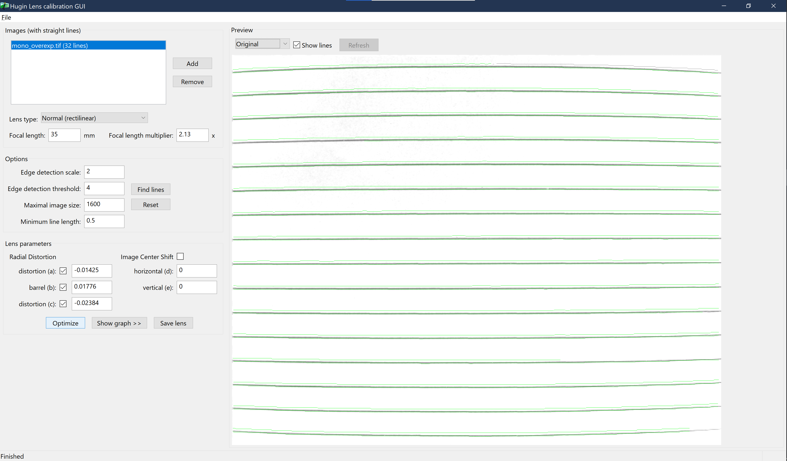
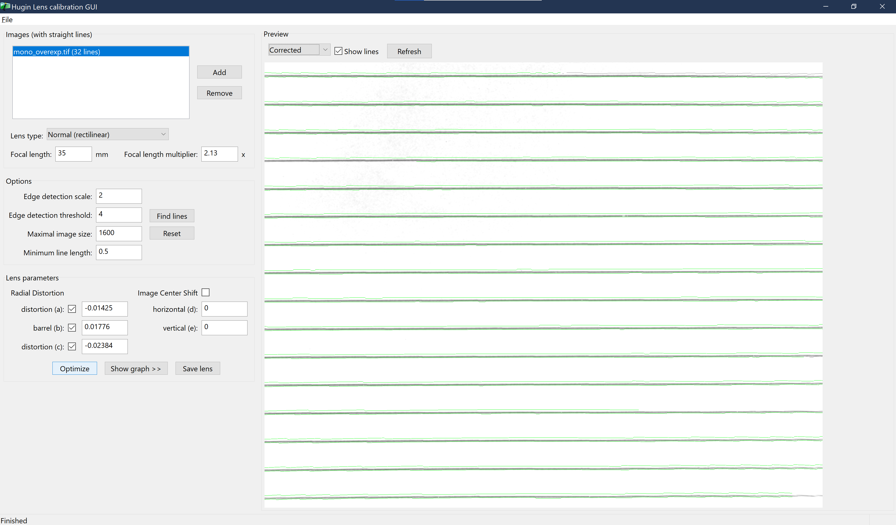
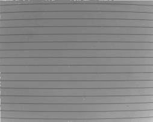
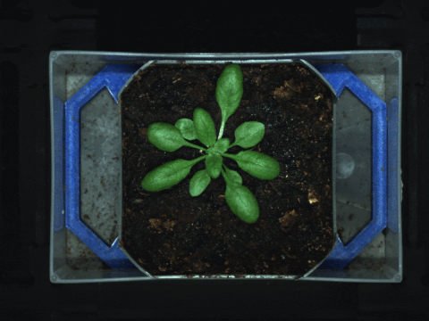
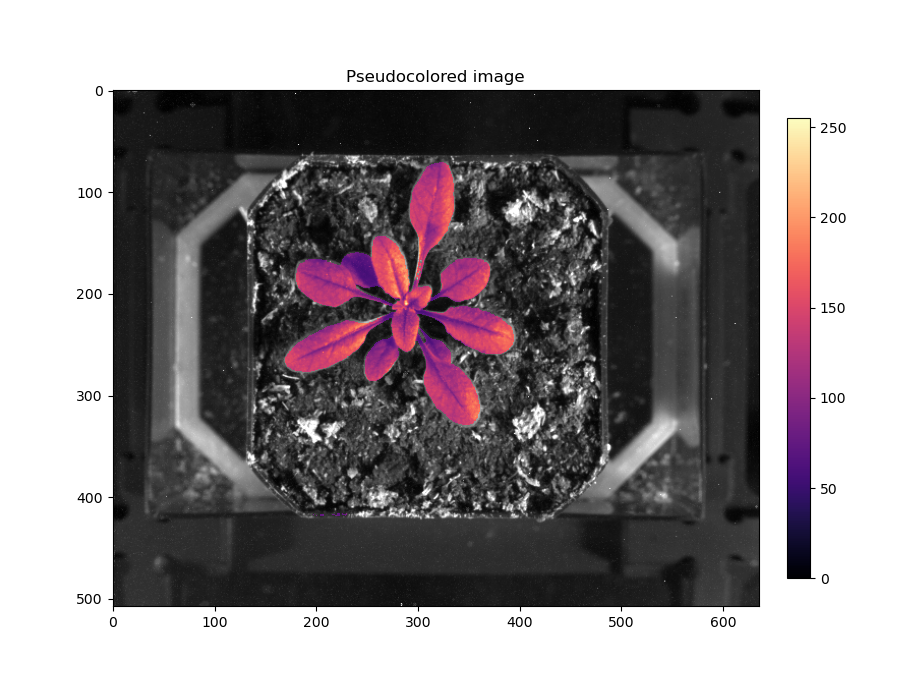

# Camera overlay

It can be useful to overlay images from different cameras. For example, the SWIR images exhibit relatively low contrast and are difficult to segment. It would in theory be easier to segment an RGB image and overlay the RGB-based mask to segment the IR image. It is not always easy to get an accurate overlay though. I investigated different techniques for overlaying the images. The main approach I used in the past was to scale and translate the mask from an RGB image to the IR image. You can see the mediocre results 

My initial hypothesis was that lens distortion were creating small differences in shape that prevented a clean overlay. When I use the term overlay it turns out I (and others I've worked with) am talking about a similarity transformation, which consists of scale, rotate, translate. In the process of writing this document I found an excellent writeup about different transformations on [scikit-image](https://scikit-image.org/docs/dev/auto_examples/transform/plot_transform_types.html?highlight=homography). Ultimately I considered a couple approaches to dealing with the poor overlay:

1. Does the lens distortion create an impossible situation? Consider that both camera/lenses have a unique radial and tangential barrel distortion so a linear scale/rotation/translation is unable to accomodate the different distortions.

2. Do differences in the x,y,z locations of the cameras result in perspective differences between the two cameras such that parallel lines converge differently between images?


## TLDR

Accounting for perspective differences between cameras produces far superior results than correcting lens correction and using an rigid or similarity transformation that maintains the relationship between parallel lines.  See the excellent writeup about different transformations on [scikit-image](https://scikit-image.org/docs/dev/auto_examples/transform/plot_transform_types.html?highlight=homography)

# Lens Distortion

There are a couple approaches to dealing with this including in opencv but I happen to be familiar the lensfun project. This is an opensource project that facilitates lens corrections for vignetting, distortion, and chromatic aberration. It is widely used in  photo manipulation and management software because the database of transform coefficients is crowdsourced.

I was mostly interested in the distortion aspect but ended up taking pictures for vignetting corrections with the RGB camera. I followed [this tutorial on pixls.us](https://discuss.pixls.us/t/create-lens-calibration-data-for-lensfun/9848) which was pretty straight forward. Lensfun has a service setup to upload images for automatic calibration but since I work in python regularly I decided to setup my own environment so I could see what is happening. I used WSL2 on Windows10 to set up a conda environment that matched the requirements in the tutorial listed in **Lens Distortion**.

My camera setup is fixed and pointed downwards so I couldn't shoot a perfect subject with perfect light as recommended. I printed parallel lines and taped them to a small box, but I was unsure if small ripples in the paper would cause a problem. I did the best I could for the pictures and the distortion and vignetting was obvious.  I ran into 2 main problems:

1. None of my images have exif metadata in the files. This is used by lensfun to lookup the camera/lens in the database and select the write correction coefficients. There aren't any particularly intuitive exif tools in python (I tried exiftool, py3exif, piexif) so I used the command line to assign my images metadata and left myself some notes in a README. Here's what that looked like

```{bash}
exiftool -EXIF:FNumber=22 -FocalLength=50 vignetting/f22.tif
```

2. When I used Hugin's manual approach (as suggested in the tutorial) to estimate my correction coefficients I got very small coefficients that didn't seem to affect my image. After some tinkering I tried Hugin's lens calibration tool and had better luck. The automatic detection of lines was imperfect with evidence of aliasing, which I why I think they recommend the manual tool, but it seems it was better than my manual control points 🤷‍♂️. I did tinker a bit by deselecting lines and changing the line detection parameters in Hugin's preview, although I'm not sure it made a big difference. Here is what I ended up with

Original                   |  Corrected
:-------------------------:|:-------------------------:
  |  

I did copied the coefficients from this screen for images from both cameras, finished the tutorial to create the lensfun.xml file and placed it at ~/.local/share/lensfun/lensfun.xml (under WSL2 on Windows 10).

To test the correction, I created this script that extracts the exif metadata and then removes the lens distortion!
```python
#! /usr/bin/env python

import lensfunpy
import cv2
import piexif

image_path = 'swirf16.tif'

img_png = image_path+'.png'
undistorted_image_path = image_path+'-dist_corrected.png'

im = cv2.imread(image_path)
cv2.imwrite(img_png, im)
height, width = im.shape[0], im.shape[1]

meta = piexif.load(image_path)
focal_length=meta['Exif'][37386]
focal_length = focal_length[0]/focal_length[1]
aperture = meta['Exif'][33437]
aperture = aperture[0]/aperture[1]
distance = .3

cam_make = meta['0th'][271]
cam_model = meta['0th'][272]
lens_make = meta['Exif'][42035]
lens_model=meta['Exif'][42036]
db = lensfunpy.Database()
cam = db.find_cameras(cam_make, cam_model)[0]
lens = db.find_lenses(cam, lens_make, lens_model)[0]
mod = lensfunpy.Modifier(lens, cam.crop_factor, width, height)
mod.initialize(focal_length, aperture, distance)

## --- distortion ----
undist_coords = mod.apply_geometry_distortion()
im_undistorted = cv2.remap(im, undist_coords, None, cv2.INTER_LANCZOS4)
cv2.imwrite(undistorted_image_path, im_undistorted)


## ---- vignetting ----
did_apply = mod.apply_color_modification(im_undistorted)
if did_apply:
    cv2.imwrite(undistorted_image_path+'-vig_corrected.png', im_undistorted)
else:
    print('vignetting not corrected, calibration data missing?')
```

The correction works, but maybe a little too aggressive



After all this I for sure we'd get the images to overlay nicely. the lines in the gif move a lot! Here is a sample image of the correction on the rgb image of arabidopsis



Unfortunately, when I tried to overlay a mask from the RGB image onto the SWIR image there was no noticable improvement.

Overlay with Distortion                   |  Overlay without Distortion
:-------------------------:|:-------------------------:
  |  


# Perspective (and Affine) Warping

After reading the homography documentation at scikit linked above and observing that the overlay was correctly centered but the leaves needed to be stretched, I thought it would be worth affine (which would incorporate shear) or perspective (which can account for viewpoint differences between two images) transformations.

The results from  `cv2.warpPerspective()` were amazing!



In short, if the relationship between parallel lines is not consistent between images because the viewpoint is different then you need a perspective transformation that does not preserve parallel lines in order to map one image onto the other.

The main difference for the user is that an affine transformation only requires 3 ground control points (GCP) to map the transformation while the perspective transformation requires 4 GCPs. The affine worked almost as well, but for barely any extra effort of a fourth point I'm going stick with the perspective warp.

I modified my existing script to use `cv2.warpPerspective()`. Finding good GCP by eye is not that easy and I shifted points 5-10 pixels in different directions after an initial visual estimate until my overlay was excellent (I used `cv2.drawMarker()` below to compare GCP locations). This isn't ideal but at least I could get to a point that I was happy with - the similarity warping never worked well despite lots of trial and error. An improvement for this would be to use the `cv2.findChessboardCorners()` function which should automatically give corresponding pixel coordinates for corners of a chessboard in an image. Another point I'll make is that I did notice some improvement when I chose GCP at the corners of the top of the pots instead of the corners of the tray. The plant and top of the pot are about an inch above the top of the tray. This indicates that the chessboard pattern needs to be appropriately setup at the right height. Lastly, I only used 1 of 18 imaging spots in the phenomics system for these calibration images. I need to test images from other locations but I suspect that the corresponding GCPs for each location will be slightly different since the camera locations will be slightly different. The easiest solution is only to image in the same spot each time until I figure out how to correctly provide the same GCP for individual spots.

I also tried with and without lens correction and noticed no improvement in the warping when a lens correction was performed first. Give the complexity of generating the calibration and implementing lensfun (I haven't tried to use it on Windows except WSL for example), I think I will skip this step.


```python
## ---- 3D perspective warping with points on pot surface with distorted images

swirpts = [(130,120),(432,64),(424,423),(187,420),(288,210)]
swirimg2=swirimg.copy()
for pt in swirpts:
    # print(pt)
    cv2.drawMarker(swirimg2, pt, color=(0,0,0),markerType=cv2.MARKER_CROSS, markerSize=60)
plt.imshow(swirimg2, cmap='Greys_r')

rgbpts = [(925,735),(2300,475),(2285,2130),(1185,2130),(1640,1155)]
img2 = img.copy()
for pt in rgbpts:
    # print(pt)
    cv2.drawMarker(img2, pt, color=(0,0,255), markerType=cv2.MARKER_CROSS, markerSize=360, thickness=2)
pcv.plot_image(img2)

rgbptsarr = np.array(rgbpts, dtype='float32')
swirptsarr = np.array(swirpts, dtype='float32')

M5, S5 = cv2.findHomography(rgbptsarr , swirptsarr, method=0)

dst5 = cv2.warpPerspective(mask, M5, (cols,rows))
p=pcv.visualize.pseudocolor(swirimg, mask=dst5, cmap='magma')

```

